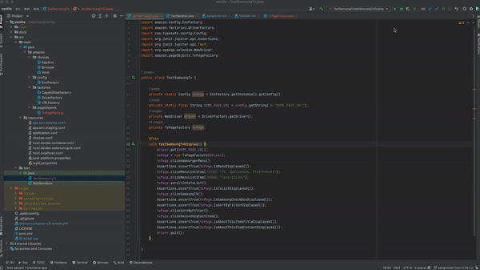

# Demo - *Automate Amazon website with Selenium & Junit library in Java*

## Agenda
* [x] Cloned from this original skeleton template [repo](https://github.com/ClipboardHealth/vanilla)
* [x] This repo leverage that cloned skeleton template then implemented the following automation cases accordingly.
* [x] Completed the automation cases of automate Amazon website with Selenium & Junit library in Java.

## The automation case test steps completed as following:
automated the website https://www.amazon.in/ using Selenium and Junit library, automated test steps as following:
* [x] The test launch amazon.in website via Chrome browser.
* [x] Click the hamburger menu list, clicked "TV, Appliances, Electronics" then clicked "Televisions"
* [x] scrolls up through the menu options to tv brand list. 
* [x] Selected "Samsung", then click sort by filters then select "Sort by: Price: High to Low" 
* [x] clicked on the second highest item in the list. 
* [x] Validate the test result of "About this item" title displayed then logs the content text to the console.
* [x] Please refer to the following test pass video screen record for reference.

## automation case test result screen record as following:

Feel free to clone or copy any of my work without any permission.
